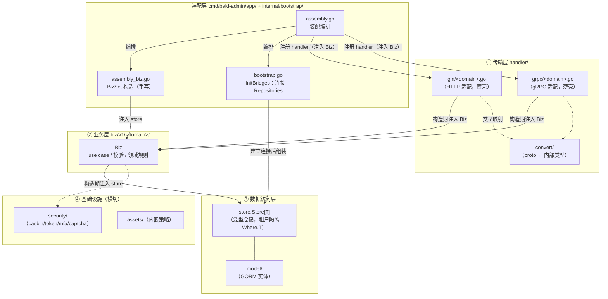
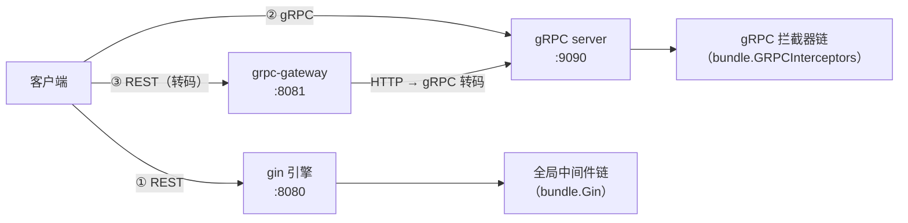
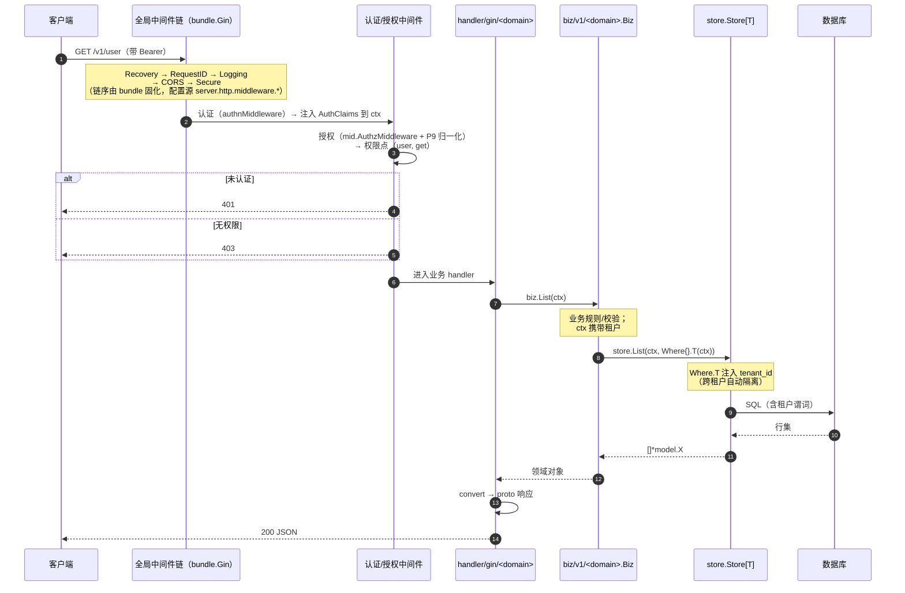
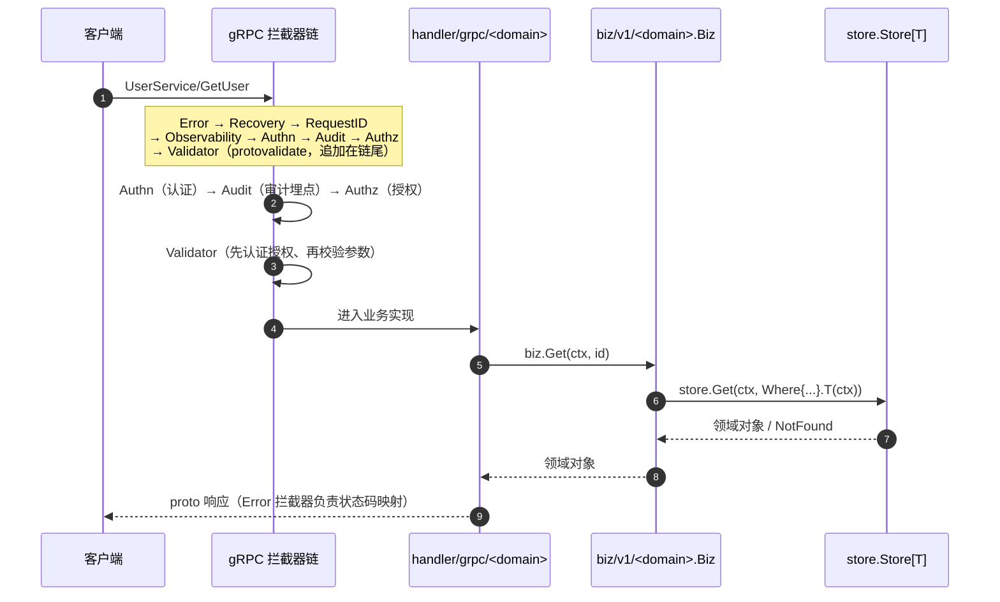
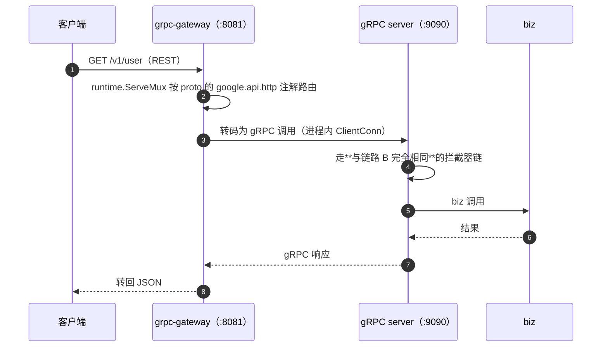

# bald-admin 设计文档

> 配套 `需求文档.md`。本文档规定基于 bald 重构 `go-wind-admin/backend` 的**具体依赖选型**与模块设计。
> 核心原则：**所有能力必须经由 bald 实现或桥接**，业务不直连引擎。

## 0. 实现契约：外部依赖禁止虚假实现

本范例是"用真实业务验证 bald 框架"的载体，**任何外部依赖都不得用手写桩、内存占位、硬编码或
模拟实现蒙混**，必须接入真实、可运行、可验证的依赖。该契约优先于一切"先跑通范式"的简化诉求。

### 0.1 禁止项（硬性约束）
- **禁止 fake / mock / stub 充当外部依赖**：数据库、缓存、消息队列、认证后端、第三方 API 等
  外部系统，不得用内存 map、固定返回值、空接口、打印日志代替。
- **禁止硬编码返回值**：handler / service 不得对"受限资源""机密""用户"等本应从存储读取的领域对象
  返回写死的字符串或常量（如 `content: "top-secret-value"` 之类演示占位）——必须经由 `store` 等
  真实 DAL 读写。
- **禁止占位式桥接**：`InitBridges` / bootstrap 中不得留"待接入"的空壳；依赖必须构造出
  可工作的真实实例并注入。
- **禁止为绕过工具链而牺牲真实语义**：proto+buf 为正式契约来源。

### 0.2 允许的简化（须显式标注且真实可跑）
- **SQLite 内存库**作为零外部依赖的真实数据库是**允许的**（它仍是真实的 GORM+DAL 读写路径，
  非内存占位）；外部 PostgreSQL/MySQL 仅在其环境具备时再切换 driver。
- 任何简化必须显式标注，且不得静默伪装成已接入真实依赖。

### 0.3 当前偏差清单（须逐步消除）
| 位置 | 现状 | 性质 | 处置 |
|------|------|------|------|
| `handler/gin/auth.go` `GET /secret/:id` 返回 `content:"top-secret-value"` | 硬编码演示值 | 违反 §0.1 | **无此问题**：经 `biz`→`store` 读真实 Secret 实体（`model.Secret` + `Repositories.Secret`） |
| `grpc/secret.go` `GetSecret` 返回 `"top-secret-value-for-"+id` | 硬编码拼接 | 违反 §0.1 | **无此问题**：统一经真实 DAL，跨租户检索被 store 隔离为 NotFound |
| `internal/security/rbac` 内存静态 RBAC 表 | 内存假实现 | 违反 §0.1 | **已不存在**：目录已删除；授权经 `internal/security/casbin` 桥接 `bald/contrib/authz-casbin`，策略数据化——p 行来自 `Repositories.RolePolicy`（DB），g 行来自 `User.Roles`，无静态 `rbac_*.csv` |
| `bootstrap.openDB()` 占位桥接 | — | — | 不存在：`openDB` 直接 `baldgorm.Open`（`bootstrap.go:849`），配置段/环境变量驱动真实 driver |
| 内存用户表 | — | — | 不存在：用户数据经 `Repositories.User`（`*store.Store[User]`） |

> 校验：`go test ./...` 中涉及外部依赖的用例必须走真实传输/真实 DAL（如 gRPC 真实连接、SQLite 真实
> 读写），不得用 fake client 或 in-memory double 替代；新增虚假实现视为回归。

## 1. 整体架构

分层**参考 `osbuilder` 脚手架模板**（clean/onion 分层），并演化出 bald 特色的**四层 + 双层装配**结构
（见 §1.2）。源项目 `go-wind-admin/backend` 是单 admin 服务 + gRPC-gateway 双协议，故采用「按服务名
`apiserver` 分顶层、服务内再按层拆分」的范式。

```
bald-admin/                                (独立 go module)
├── backend/
│   ├── go.mod                            replace github.com/kalandramo/bald => ../../bald
│   ├── api/
│   │   ├── buf.yaml / buf.gen.yaml / buf.openapi.gen.yaml   buf 生成配置（契约与生成配置的唯一来源）
│   │   ├── protos/<domain>/*.proto        业务契约（user/dict/menu/permission/secret/tenant/…）
│   │   └── gen/go/<domain>/v1/*.pb.go     生成代码（Go 包路径 `api/gen/go/<domain>/v1`）
│   ├── cmd/bald-admin/app/                **装配层**（非业务逻辑）
│   │   ├── assembly.go                    buildApp/newApp：装配编排（构造期骨架 + Run 期钩子）
│   │   ├── registries.go                  各资源域 registry（database/cache/storage/tracer/…）
│   │   ├── servers.go                     gRPC 选项 + gateway 注册（bundle 链在此成链）
│   │   ├── assembly_biz.go                **手写**业务对象装配（InitializeBiz → BizSet）
│   │   ├── asynq.go / cron.go / sse.go    后端子模块装配（契约 provider / 逃生舱）
│   │   └── audit.go / audit_wiring.go     审计后端装配与热切协调
│   ├── configs/
│   │   └── bald-admin.yaml.example        配置模板（真实 yaml 被 .gitignore 忽略）
│   └── internal/
│       ├── apiserver/                     **单服务，按层组织**
│       │   ├── server.go                  注册编排：聚合各域 Register*
│       │   ├── bizset.go                  BizSet：全部业务对象的聚合容器
│       │   ├── biz/v1/<domain>/           业务逻辑层（use case）
│       │   ├── handler/
│       │   │   ├── gin/<domain>.go        HTTP 适配（薄壳：认证/授权中间件 + 调 biz）
│       │   │   ├── grpc/<domain>.go       gRPC 适配（薄壳：调 biz）
│       │   │   └── convert/               proto ↔ 内部类型映射
│       │   ├── middleware/apiaudit/       业务级中间件（API 审计）
│       │   ├── model/                     GORM 实体（含角色/权限/组织等）
│       │   ├── assets/                    内嵌资源（casbin 策略等）
│       │   └── e2e/                       端到端测试
│       ├── bootstrap/                     **运行期桥接层**（见 §1.2）
│       │   ├── bootstrap.go               InitBridges：建立 DB/Redis 连接 → 组装 Repositories
│       │   └── ...                        各域 Repository 构造
│       └── security/                      安全基础设施
│           ├── casbin/  authz/            RBAC 策略引擎 / ReloadableAuthorizer 装饰器
│           ├── token/  mfa/  captcha/     令牌签发、多因素、验证码
│           ├── loginpolicy/               登录策略（限流/熔断/重试的组合）
│           └── audit/                     审计后端（含全局动态转发器 Global()）
```

### 1.1 与 osbuilder 模板的分层偏差（必须保留，因 bald 原则）
| 维度 | osbuilder 模板 | bald-admin（bald 约定） | 理由 |
|------|---------------|---------------------------|------|
| 依赖注入 | `google/wire` | **框架层** `appkit.Registry`（原生）；**业务层**用**普通 Go 函数手写装配**（`cmd/bald-admin/app/assembly_biz.go` 的 `InitializeBiz`） | bald 核心不内置 DI 框架。范例**刻意不引 wire**：编译期保护已由 Go 编译器对 `xxx.New(...)` 调用本身提供；且 33 个泛型仓储 + 运行期包级变量与 wire 的类型匹配模型不契合（见 assembly_biz.go 头注） |
| 授权 | `casbin` | **`authz.Authorizer` 契约** + casbin 业务实现（`internal/security/casbin`）；另加 `ReloadableAuthorizer` 装饰器支持热重载 | 核心不内置引擎（P7），但业务层可桥接 |
| 基础设施 | `onexstack`（Store/Server/错误） | `bald` 自有 `pkg/store`/`pkg/appkit`/`pkg/berrors`；**且已接入真实注册中心（nacos）/Redis/asynq/OTLP** | 本次目标即验证 bald |
| 实体层名 | `model` | `model`（沿用，非 `entity`） | 与模板对齐 |
| 转换层 | `pkg/conversion` | `internal/apiserver/handler/convert` | 就近于 handler 层 |
| 配置 | 自研 viper | `bald bconf`（proto-first，契约驱动装配） | 配置单一真相源 |

### 1.2 分层与依赖方向（分层不变量）

**四层**，依赖**单向自外向内**，内层绝不反向 import 外层：



**分层不变量（有测试固化）**：
1. `biz` 只依赖 `store`/`model`/`berrors` 与 `pkg/*` 契约——**不 import** `handler`、`cmd`、`internal/bootstrap`。
2. `handler` 只做「取参 → 调 biz → 写响应」，不含业务规则；跨层类型转换集中在 `convert`。
3. `store`/`model` 不感知 HTTP/gRPC（数据面与控制面解耦）。
4. 装配层（`cmd`+`bootstrap`）是**唯一**允许同时看见全部层并做连线的地方。

### 1.3 请求数据流程图

系统有三条请求入口，**认证/授权/审计的一致性是强约束**（同一份 RBAC 策略与审计语义）：



**链路 A：REST 直连（gin 引擎，`:8080`）**



**关键点**：
- **认证与授权是两层中间件**，且**挂在路由组上**（`handler/gin/<domain>.go` 的 `e.Group("/v1")`），
  **不是全局链**——因为 `/v1/login` 必须公开。这是「分组保护」模式（与 bundle 全局链模式并存）。
- **P9 归一化**：REST 的 `(path, method)` 与 gRPC 的 `FullMethod` 被归一到**同一套权限点**
  （如 `(user, get)`），故同一份 casbin 策略对两种协议同时生效。
- **租户隔离下沉到 DAL**（`Where.T(ctx)`），不在业务层手写租户谓词——漏写即越权，故下沉为不可绕过。

**链路 B：gRPC 直连（`:9090`）**



**链路 C：REST → gateway 转码（`:8081`）**



**gateway 的意义**：它与链路 A 是**两种可选的 REST 暴露方式**——链路 A 手写 handler（可控性强、
易加业务中间件），链路 C 由 proto 注解自动转码（零手写但受注解表达力限制）。范例各保留其一以验证
两条路都能走通。注意：**gateway 面不经过 gin 全局链**（它是独立端口 + 独立 `http.Handler`），
故其 CORS 等 gin 侧中间件**不适用**——这是已知边界，不是缺陷。


## 2. 依赖选型（逐项决策）

| 能力域 | 源项目依赖 | bald 选型 | 决策理由 |
|--------|-----------|----------|----------|
| 核心框架 | `go-wind-toolkit`/`gow` | **bald 核心** | 本次重构目标即验证 bald |
| 配置管理 | 自研 viper 封装 | **bald `pkg/conf`**（proto-first） | 配置/类型单一真相源，viper 四源已由 bald 封装 |
| 认证 | `pkg/jwt`（golang-jwt 自封装） | **`bald/contrib/authn-jwt`** | 实现 `authn.Authenticator`，HS256 白名单，无硬编码密钥 |
| 授权 | `pkg/authorizer` + 自研 RBAC | **bald `pkg/authz.Authorizer`** + 业务 RBAC 实现 | 核心仅定义接口（避免 casbin 入核），业务侧桥接 RBAC |
| 数据访问 | `ent` (entgo.io/ent) | **`bald/contrib/store-gorm`** + GORM 实体 | 核心零耦合；泛型 `Store[T]` 同构 ent 的 Repository |
| 分页 | 自研 | **bald `pkg/store` 三策略** | Page/Offset/Token 已由 P2 落地 |
| 多租户 | 中间件手动注入 | **`store.RegisterTenant` + `Where.T(ctx)`** | P8 下沉 DAL，查询自动隔离 |
| 数据权限 | 自研 Viewer | **`store.RegisterDataScope`** | P9 五级范围函数注入 |
| 任务队列 | `asynq`（Redis） | **`bald/transport/asynq`**（契约装配 `server.asynq`） | 经契约段装配，真实 asynq + Redis |
| 对象存储 | `minio-go`（OSS） | **`bald/oss/s3` 契约 + minio 桥接** | 经 `storage.minio` 契约段装配 |
| 缓存 | `redis-go` + `HExpire` | **bald `cache/redis`**（`cache.redis` 契约段） | 经契约段装配真实 Redis |
| 服务注册 | `etcd`/`consul` | **bald `registry` 契约 + nacos 后端** | 经 `registry` 契约段装配 |
| 链路追踪 | `jaeger` + otel | **bald `tracer` 契约 + OTLP** | 经 `tracer` 契约段装配真实 OTLP 端点 |
| 依赖注入 | `google/wire` | **框架层** `appkit.Registry`；**业务层**手写装配（`assembly_biz.go`） | bald 核心不内置 DI；范例不引 wire（理由见 §1.1） |
| gRPC-Gateway | `grpc-gateway` | **复用 bald `_example` 的 `register_grpcgw` 范式** | 传输中立，核心不钉 grpc-gateway |
| 代码生成 | `gow` + `buf` + `protoc-gen-*` | **bald `codegen` 子命令 + buf** | 复用源项目 `buf.gen.yaml` |

### 2.1 明确**不进 bald 核心**的依赖（业务层可按需采用）
> 「不进核心」指 bald 核心 `go.mod` 不引入，不表示业务项目不能用。业务项目（如 `bald-admin`、源项目
> `go-wind-admin/backend`）可在业务层桥接这些引擎（满足 §0 真实依赖契约）。
- ❌ `ent`：**核心**不引入;以 GORM 实体 + `bald-store-gorm` 替代（图式关系在业务层用外键/关联查询表达）。业务层仍可按源项目风格保留 ent。
- ❌ `kratos`：**核心**不引入;以 bald `appkit` + gin/gRPC 原生替代。
- ❌ `google/wire`：**核心不引入，本范例亦不引入**——业务装配用普通 Go 函数（`assembly_biz.go`）。`appkit.Registry` 负责的是**框架插件发现**（另一层职责），不是业务对象装配。
- ❌ 源项目 `pkg/jwt`、`pkg/authorizer`、`pkg/middleware/auth`、`pkg/middleware/ent`：
  由 `bald-authn-jwt` + `bald/pkg/authz` + `bald/pkg/middleware` 替代(核心层契约)。
- ❌ `casbin`：**核心**不引入;RBAC 用 `authz.Authorizer` 实现,业务层可桥接 casbin 作为该接口的真实实现(源项目即用 casbin,优先复用)。

### 2.2 范例定位

`bald-admin` 是 **bald 框架的能力验证载体**，而非 `go-wind-admin/backend` 的复刻。判定取舍的原则：

- **框架能力优先**：凡 bald 已提供契约的域（认证/授权/审计/缓存/注册/任务/可观测性），一律经该契约接入，
  不自建平行实现。
- **桥接落在业务层**：引擎（casbin、GORM、go-redis、asynq、minio…）只出现在 `bald-admin` 的 `go.mod`
  或其依赖的 `bald/contrib/*` 子模块中，**绝不**写进 bald 核心（核心不钉死具体引擎）。
- **核心零耦合**：所有横切能力经接口注入（`authn.Authenticator`、`authz.Authorizer`、`audit.Auditor`、
  `store.Store[T]`…）。

### 2.3 依赖引入位置

- **bald 核心 `go.mod`**：不引入任何业务引擎依赖（保持零耦合）。
- **`bald-admin` `go.mod`**：引入业务侧桥接所需（`gorm`、`golang-jwt`、`minio-go`、`redis`、`asynq` 等，
  经 contrib 传递或直引）。
- **`bald/contrib/*`**：独立 module；通用能力晋升至此（判定规则见 §3.5）。

## 3. 关键模块设计

### 3.1 认证授权

```
authn.Authenticator  = bald/contrib/authn-jwt（HMAC/非对称）
authz.Authorizer     = 装饰链：ObjectAlias( Reloadable( contrib/authz-casbin ) )
```

- **登录**：`biz/v1/auth` 校验凭据后，经 `authenticator.IssueToken(claims)` 签发 JWT。
- **认证中间件**：Bearer → `authn.ContextWithToken` → `Authenticate` → `ContextWithAuthClaims`；
  过期校验下沉 `Authenticator`（契约要求校验 `ExpiresAt`）。
- **授权中间件**：`mid.AuthzMiddleware(authorizer, WithObjectResolver(authz.DefaultHTTPObject), ...)`。
  **认证/授权挂在路由组上**（`handler/gin/<domain>.go` 的 `e.Group("/v1")`），**不是全局链**——
  因为 `/v1/login` 必须公开（分组保护模式，见 §1.3）。
- **策略真源 = DB**：`loadPolicyCSV`（`internal/bootstrap/bootstrap.go`）从 `Repositories.RolePolicy`
  取 p 行、从 `User.Roles` 取 g 行，注入 contrib casbin。**无静态策略文件**；无策略行时默认拒绝（fail-closed）。
- **热重载**：`internal/security/authz.ReloadableAuthorizer` 装饰器持可整体替换的内层授权器，
  业务在角色/用户变更后调 `bootstrappkg.ReloadPolicies()` 即时生效（不必重启）。
- **object 别名**：P9 归一化把 gRPC Service 名压成无分隔小写（`OrgUnitService` → `"orgunit"`），
  而策略 object 沿用 HTTP 路径段命名（`"org-units"`）；`ObjectAliasAuthorizer` 在内层**明确拒绝**后
  按别名表重试一次。**语义边界（勿放宽）**：只换 object 名，subject/action 不变；内层报错时不重试；
  别名命中仍需内层放行。

### 3.2 多租户 + 数据权限

- **租户隔离下沉 DAL**：查询经 `store.Where.T(ctx)` 自动注入 `tenant_id` 谓词。**不在业务层手写租户条件**
  ——漏写即越权，故下沉为不可绕过。
- **数据权限**：`store.RegisterDataScope*` 注册范围函数（五级），经 `mergeDataScope` 拼接。
- `AuthClaims` 携带 `TenantID`/`Roles`/`Scopes`，供 scope 函数与 authorizer 消费。

### 3.3 数据层

```
provider := baldgorm.NewGormProvider[T](db, func(t *T) string { return t.ID })
repo     := store.NewStore[T](provider)
```

- 实体实现 `store.Entity` 约束（主键、表名）；迁移经 `provider.Migrate`（GORM AutoMigrate）。
- 分页：`detectStrategy` 自动识别 Page/Offset/Token 三策略。
- **仓储聚合**：`internal/bootstrap.Repositories`（`*store.Store[T]` 字段集），由 `InitBridges` 建立连接后组装，
  **构造期注入** biz（不读包级变量）。

### 3.4 配置

- 契约配置：`bald bconf`（proto-first）。`bconf/proto/bootstrap/v1/` 是唯一真相源，
  生成物在 `bconf/gen/go/`。
- 业务配置：`cmd/bald-admin/app/options`（plain struct + mapstructure），经 `appkit.Bind` 注册 flag。
- **两阶段装载**：`config` 契约段（引导信息）先于运行期装载；`preloadBootstrap` 装本地文件，
  再由 `FromBootstrap` 内化远程源与热更新。

### 3.5 双传输与中间件

- **三条入口链路**（详见 §1.3）：REST 直连 gin、gRPC 直连、grpc-gateway 转码。
- **中间件链由 `pkg/middleware/bundle` 固化**，配置源 `server.http.middleware.*`：

  | 链 | 顺序（外→内） |
  |---|---|
  | gin | Recovery → RequestID → Tracing → Logging → CORS → Secure → Authn → Audit → Authz → RateLimit → Timeout |
  | gRPC | Error → Recovery → RequestID → Observability → Authn → Audit → Authz → Validator |

- **链序不变量（硬约束）**：`Audit` 必须置于 `Authn` **内侧**（才能读到认证注入的 subject/tenant）、
  `Authz` **外侧**（才能捕获 deny 的最终 result）；置于最外层会因外层 ctx 不含 Authn 注入值而读不到 subject。
  gRPC 的 `Error` 必须最外层（否则 `*berrors.Error` 被兜底成空 Unknown）。
- **生命周期**：`FromMiddleware` 返回的 `close` 挂停机 Effect（逆序回放，先于框架底座）；
  运行期资源（认证器/授权器/仓储）经 `WithGRPCOptions` / `WithExtraServerFunc` **运行期求值**。

## 4. 与 bald 核心的联动验证

- **本仓即验证载体**：bald 核心改动后，在本仓执行 `go build ./... && go test ./...`，真实业务无回归即证明核心未破坏兼容。
- 依赖姿态：**零 replace**（纯 Go module 代理解析），确保消费的是发布版本而非本地覆盖。
- e2e 覆盖：登录（401→token）→ 受保护接口（403 越权）→ 跨租户隔离（404）。

## 5. 风险与缓解

| 风险 | 缓解 |
|------|------|
| 跨子模块发版顺序颠倒 → 消费方构建失败 | 发布链**顺序不可颠倒**（见下）；`replace` 在发布时被忽略，消费方按 `require` 解析 |
| 已发布 tag 不可改写 | Go module 代理把已缓存版本视为不可变快照，删 tag 重推不传播；修正只能**递增版本号**重发 |
| 策略与路由命名不一致 → gRPC 面恒 403 | `ObjectAliasAuthorizer` 别名表 + e2e 双协议覆盖 |
| 授权缺失时静默放行 | 全链 fail-closed：无策略行拒绝、内层 nil 拒绝、`ObjectAlias` 无内层拒绝 |

**发布链（跨子模块，顺序不可颠倒）**：

1. 改动所在**子模块**先升其依赖的 `require`（如后端模块升 `registry`）；
2. 打该子模块 tag；
3. 其**上游**模块升 `require` 到新版本，再打自己的 tag；
4. root 最后升 `require` 并打 `vX.Y.0`；
5. 消费方（bald-admin）`go get` 新版本为零 replace 纯代理解析。
